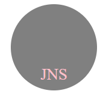

# svg-logo-maker

## Description

Challenge 10 -- SVG Logo Maker

This project was built so that a user can easily create a new basic logo for anything by simply answering just 4 questions. The application prompts the user to select a color and shape, provide text for the logo, and saves the generated SVG to a `.svg` file. Throughout building this project, I solidified my knowledge in using Node JS & Inquirer, and learned more about jest testing, svg files, and OOP (especially classes). 

## Table of Contents

- [Installation](#installation)
- [Usage](#usage)
- [License](#license)
- [Badges](#badges)
- [Features](#features)
- [Tests](#tests)
- [Questions](#questions)

## Installation

- Please have installed Node JS before attempting to run the program (I have v20.10.0)

- Please also install the dependencies inside the code shown in the package.json of Inquirer v8.2.4 and Jest v28.1.3 (You can just use `npm i`)

## Usage

- Link to walkthrough video: _(click the logo image)_

For further instructions on how to use the app with inquirer, see the [Tests](#tests) section.

## License

[MIT License](https://opensource.org/licenses/MIT)

## Badges

## Features

- JavaScript
- Node JS
- Inquirer
- Jest

## Tests

You can freely test this application by first having the dependencies installed, open your terminal, type `npm run test` and hit enter, which will run my written jest testing (file: shapes.test.js).

You can also test this application by opening your terminal, type `npm run start` then simply answer the questions as they appear. Once all questions are done, a svg file called 'logo.svg' will be placed inside the examples folder. You can then either save that file, or image, or you can `npm run start` again and start over, generating a new logo in its place.

## Questions

If you have any questions, feel free to reach out to me via [GitHub](https://github.com/jskelly8/) or email me at jessskelton888@gmail.com.
